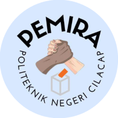

### WEBSITE URL
[https://pemira.protic.web.id](https://pemira.protic.web.id/)

1. **Clone Repository**
```bash
git clone https://github.com/Protic-PNC/pemira-project.git
```
```
cd pemira-project
```
```
composer install
```
```
cp .env.example .env
```
```
php artisan key:generate
```
```
npm install
```
```
php artisan migrate (:fresh)
```
```
npm run dev
```
```
php artisan serve
```
add seeder
```
php artisan db:seed
```
default user
```
admin
username: admin@example.com
password: 12345678
```
```
user
username: user@example.com
password: 12345678
```

### **2. Artisan commands di cPanel**

Untuk menjalankan artisan (migration, seed, storage:link, dll.) di shared hosting yang tidak menyediakan SSH atau terminal access, bisa pakai route sebagai alternatif. 
Aplikasi ini sudah tersedia route artisan, untuk memakainya ikuti langkah berikut:

  - Pertama, atur env variable `APP_DEBUG` pada file `.env` menjadi true:
    ```
    APP_DEBUG=true
    ```
    Untuk mengedit file `.env` bisa menggunakan file manager pada cPanel.

  - Lalu, Akses URL `/artisan?cmd=<perintah>` pada browser, contoh:
    ```shell
    # php artisan storage:link
    https://pemira.protic.web.id/artisan?cmd=storage:link

    # php artisan key:generate --show
    https://pemira.protic.web.id/artisan?cmd=key:generate --show
    ```
    atau lewat terminal,
    ```shell
    # curl
    curl --get --data-urlencode "cmd=migrate --force" pemira.protic.web.id/artisan

    # wget
    wget -qO- "https://pemira.protic.web.id/artisan?cmd=db:seed --force"
    ```
  - Cuma beberapa perintah saja yang dibolehkan secara default.
    Untuk kustomisasi, bisa edit file `routes/artisan.php`.
    Ubah variable `$allow_list` untuk menambah perintah.

Atau kalau shared hosting support SSH atau terminal access, bisa run:
```shell
/usr/local/bin/ea-php81 artisan <command>
```
Sesuaikan dengan versi php, contoh php7.4: `/usr/local/bin/ea-php74`.
Kalau masih belum bisa, bisa pakai cara yang atas.

<p align="center"><a href="https://pemira.protic.web.id/login" target="_blank"></a></p>

<p align="center">
<a href="https://github.com/laravel/framework/actions"></a>
<a href="https://packagist.org/packages/laravel/framework"></a>
<a href="https://packagist.org/packages/laravel/framework"></a>
<a href="https://packagist.org/packages/laravel/framework"></a>
</p>

# Pemira Project

This project is a system for electing leaders of an organization. It was developed by members of Protic.

## Contributing
1. Hendri Wahyu Perdana
2. Nafis Watsiq Amrulloh
3. Fariani Vinita Tamonob
4. Yanuar Prayoga

## License

The Laravel framework is open-sourced software licensed under the [PROTIC License](https://protic.web.id/).
